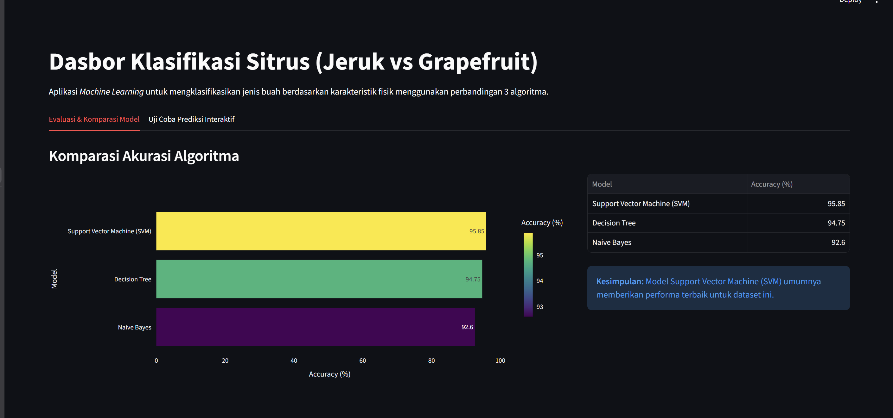
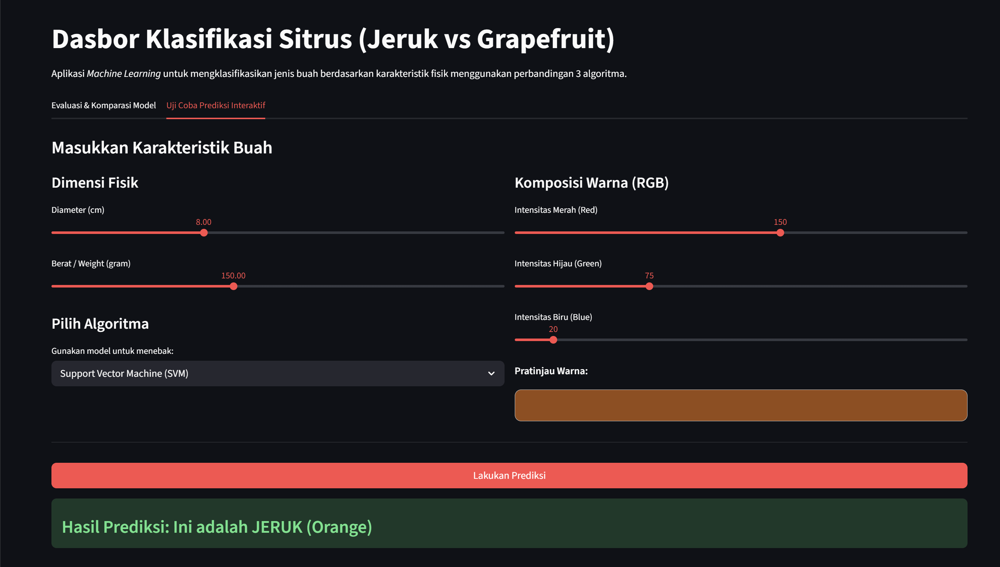
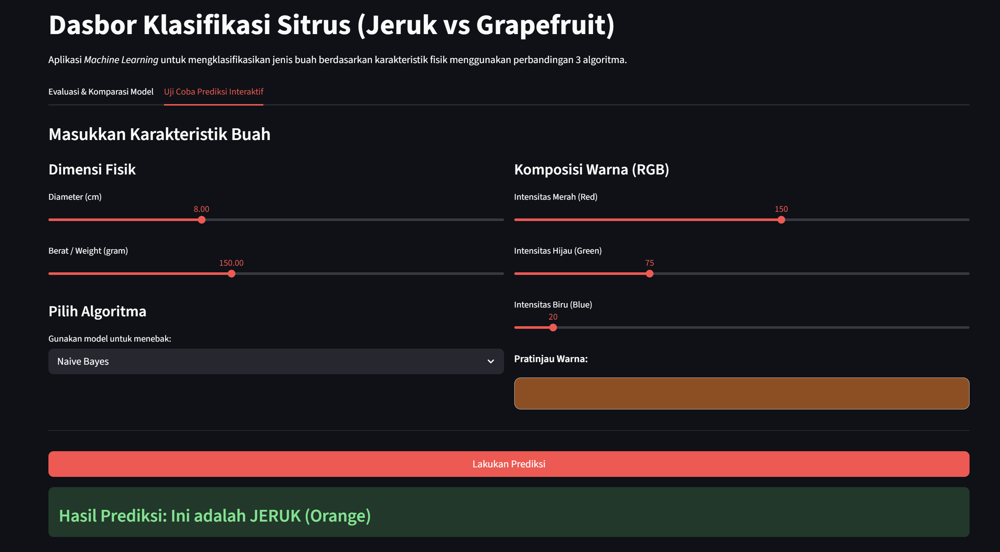
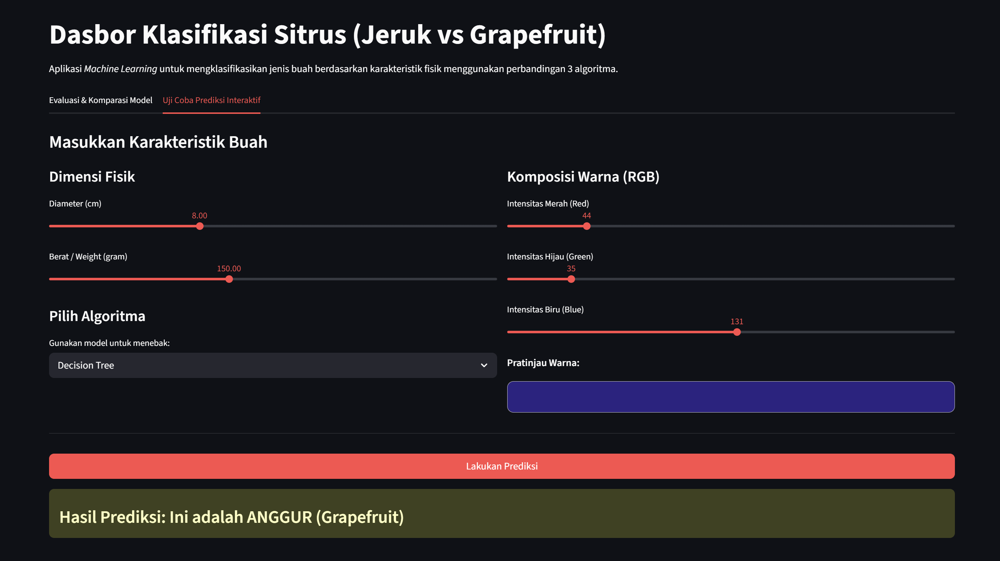

# 🍊 Citrus AI Intelligence: Orange vs Grapefruit Classification


Proyek ini adalah implementasi *Machine Learning* terintegrasi dengan antarmuka web modern (Dashboard) untuk mengklasifikasikan jenis buah sitrus (Jeruk atau Grapefruit) berdasarkan karakteristik fisiknya. Proyek ini dikembangkan untuk memenuhi evaluasi Ujian Tengah Semester dengan membandingkan tiga algoritma klasifikasi utama.

Dataset bersumber dari: [Kaggle - Oranges vs Grapefruit](https://www.kaggle.com/datasets/joshmcadams/oranges-vs-grapefruit).

---

## Fitur Utama

- **Analitik Komparatif:** Mengevaluasi dan membandingkan performa tiga model ML secara *real-time*.
- **Modern Web Dashboard:** Antarmuka interaktif yang dibangun menggunakan Streamlit dengan desain UI/UX bergaya *Enterprise Dashboard*.
- **Prediksi Interaktif:** Pengguna dapat memasukkan dimensi fisik (diameter, berat) dan nilai RGB buah untuk mendapatkan hasil prediksi secara langsung.
- **Visualisasi Data:** Implementasi Plotly Express untuk merender grafik batang yang elegan dan responsif.

---

## Cuplikan Aplikasi (Screenshots)

### 1. Panel Dasbor & Metrik Akurasi
> Menampilkan komparasi akurasi dari ketiga model yang digunakan.



### 2. Studio Prediksi Interaktif
> Menampilkan panel input pengguna dengan slider dan indikator warna *real-time*.





---

## Arsitektur Pipeline Machine Learning

Sistem ini dibangun melalui beberapa tahapan *pipeline* standar industri:

1. **Data Loading:** Memuat dataset tabular berisi 10.000 baris observasi yang mencakup fitur `diameter`, `weight`, `red`, `green`, dan `blue`. Target klasifikasinya adalah kolom `name`.
2. **Data Preprocessing:**
   - **Label Encoding:** Mengubah kelas target string ('orange', 'grapefruit') menjadi representasi biner (0, 1).
   - **Data Splitting:** Membagi dataset menjadi *Training Set* (80%) dan *Testing Set* (20%) menggunakan metode *stratified sampling*.
   - **Feature Scaling:** Menerapkan `StandardScaler` untuk menstandardisasi distribusi fitur, yang sangat krusial untuk performa algoritma berbasis jarak seperti SVM.
3. **Model Training & Comparison:**
   Melatih dan membandingkan tiga algoritma klasifikasi:
   - **Decision Tree Classifier:** Pemisahan berbasis *information gain*.
   - **Naive Bayes (Gaussian):** Pendekatan probabilitas probabilistik bersyarat.
   - **Support Vector Machine (SVM):** Pendekatan optimasi *hyperplane* dengan *linear kernel*.
4. **Evaluation:**
   Mengekstraksi *Accuracy Score* dan *Classification Report* untuk mengukur metrik keberhasilan masing-masing model pada data uji yang belum pernah dilihat sebelumnya.

---

## Struktur Direktori

```text
citrus-classification/
├── data/
│   └── citrus.csv             # Dataset CSV (Diunduh dari Kaggle)
├── src/
│   ├── __init__.py
│   └── main.py                # Core Class Pipeline (CitrusClassifier)
├── app.py                     # Antarmuka Frontend (Streamlit Dashboard)
├── requirements.txt           # Dependencies proyek
└── README.md                  # Dokumentasi ini
```

---

## Panduan Instalasi dan Penggunaan

Ikuti langkah-langkah berikut untuk menjalankan proyek ini di mesin lokal Anda:

### 1. Prasyarat Sistem
Pastikan Anda telah menginstal **Python 3.10** atau yang lebih baru.

### 2. Clone Repository
```bash
git clone https://github.com/rakaalpiansyah/citrus-classification.git
cd citrus-classification
```

### 3. Persiapkan Dataset
Unduh dataset dari tautan Kaggle di atas, lalu letakkan file `citrus.csv` di dalam direktori `data/`.

### 4. Instalasi Dependensi
Sangat disarankan menggunakan *Virtual Environment* (venv).

```bash
# Membuat environment (opsional)
python -m venv venv

# Aktivasi environment (Windows)
venv\Scripts\activate

# Aktivasi environment (Mac/Linux)
source venv/bin/activate

# Instal library yang dibutuhkan
pip install -r requirements.txt
```

### 5. Jalankan Aplikasi
Jalankan server Streamlit menggunakan perintah berikut:

```bash
streamlit run app.py
```
Aplikasi akan secara otomatis terbuka di *browser default* Anda pada alamat `http://localhost:8501`.